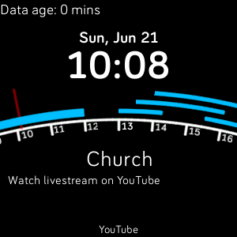
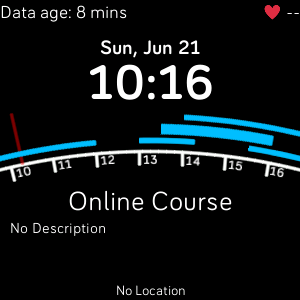
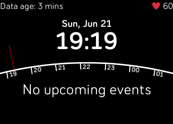
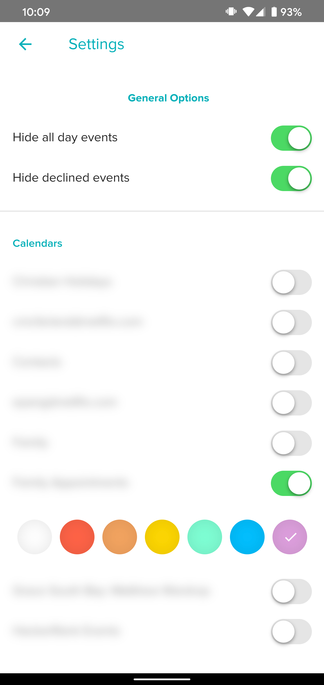

# Agenda Arc Clockface

This clockface shows upcoming calendar events for the next rolling ~7 hours,
rendered attractively on an arc. Event information is shown below the arc, and
you can cycle forward or backward through the events by tapping on the right or left
sides of the screen respectively.

In the settings, you can configure which calendars are shown on the clockface (none
are selected by default), as well as whether to omit all-day and/or declined events.

Currently, up to 20 events can be shown as arcs at a time. This is an arbitrary but
hard limit, due to the fact that you cannot programmatically create new elements
using the Fitbit SDK. If this is an impractical limitation for anyone, let me know and
I can increase the maximum number of events.

This is an open-source clockface, and contributions are welcome.

## Screenshots






## Building locally

To build and test locally, you will need a fitbit account, and either a device
or the Fitbit OS emulator. You will also need `npm`.

Once you are ready, open a shell prompt inside of this project directory, and
run `npm install`. You can then enter the fitbit shell using:

```
FITBIT_DEVBRIDGE_DUMP=1 npx fitbit
```

Enter `help` to see the available commands. The most useful will likely be
`bi`, which is shorthand for `build; install`.
